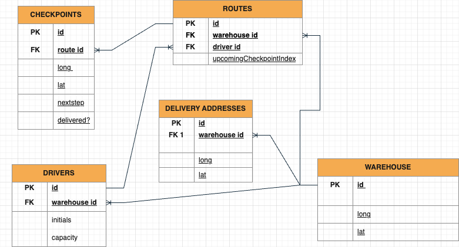
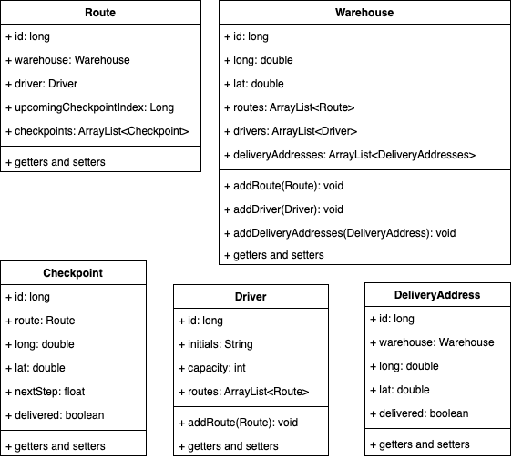
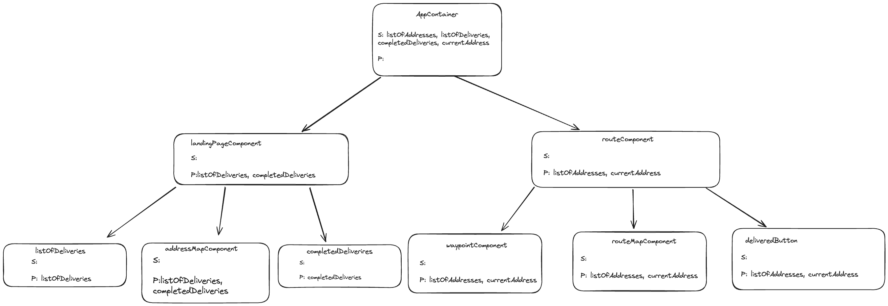

# 🚚 PITSTOP DELIVERY OPTIMIZATION 🚚 

## Project aims
#### Brief: RainforestRetail handles deliveries with a manual system, delivery routes are planned by hand, and there is a long wait for parcel deliveries.
---

The Pitstop Delivery Optimization System is a full-stack application that aims to allocate and optimize the route planning for warehouse drivers, ultimately increasing efficiency and automating the delivery process.

This project utilizes the Spring Boot framework for the backend and React for the frontend, providing a seamless and user-friendly experience.


## Contents 
1. [Documentation](#1-documentation)
2. [Installation and Set Up](#2-installation-and-set-up)
3. [Technologies Implemented](#3-technologies-implemented)
4. [MVP and Extensions](#4-project-MVP-and-extensions)
5. [Structure and Diagrams](#5-structure-and-diagrams)
6. [Features](#6-features)
7. [Routes and Endpoints](#7-routes-and-endpoints)
8. [Use Of External API](#8-use-of-external-api)
9. [Contributors](#9-contributors)


##

## 1. Documentation
The following links provide supporting documentation for our project aims, challenges, risks and target customers.
- [Business Case](Capstone_Project_Business_Case.docx) NEEDS FILE CHANGE
- Risk Register NEEEDS ADDING
- [Personas](Diagrams/personas.png)
- [Mid-Project Retrospective](Diagrams/Retrospective.pdf)


## 2. Technologies Implemented
- **Backend:**
  - Spring Boot
  - Java
  - Database (SQL)
  - Geoapify Route Planner API, [see section 9 for more info](#use-of-external-api)

- **Frontend:**
  - React
  - JavaScript, HTML, CSS
  - React-Leaflet
  - Leaflet-Routing-Machine
  - React-Burger-Menu
  - React-Geocoder-Autocomplete

## 3. Installation and Set up
Follow the steps provided to run the application on your device...

**Clone the Repository:**
```
    git clone git@github.com:H323K14H/BNTA_Capstone.git
```

**Backend Setup:**
   - Navigate to backend_server
   - Refresh maven dependencies
   - Insert external API key into RouteService 
   - Create the pitstop_db database
   - Run the Spring Boot application
```
    cd backend_server
    createdb pitstop_db
```

**Frontend Setup:**
   - Navigate to frontend_client
   - Run npm i to install libraries
   - Insert external API key into LandingPage.js
   - Run npm start to Access the application at `http://localhost:3000`

```
    cd frontend_client
    npm i
    npm start
```

## 4. MVP and Extensions

- **MVP**
    - Make a call to an external API (geoapify) to retrieve an optimized route
    - Display a map with the route drawn, warehouse and locations marked
    - Hamburger menu which acts as a Navigation bar to display 'My Route', a list of all addresses, 'more info' using router links
    - 'Generate Route' button to sned POST request to optimize the route and display the map
    

- **Extensions**
    - Collected/Delivered button to mark a checkpoint as completed
    - Counter to keep track of the number of deliveries made
    - Display the next address and change icons based on if they have been completed
    - Assign a driver to a route
    - Optimize multiple routes using a dynamic amount of delivery addresses


## 5. Structure and Diagrams
**[Entity Relationship Diagram](Diagrams/Capstone_ERD_Diagram_v3.png)** NEEDS UPDATING?



**[Class Diagram](Diagrams/capstone_class_diagram.drawio.png)** NEEDS UPDATING 



**[Wireframe](Diagrams/Wireframes.png)** 


**[Component Diagram](Diagrams/Components.png)**



## 6. Features

- **Route Optimization 🚚 :** The system calculates and suggests the most optimized routes for delivery drivers based on distance efficiency.

- **Direction Tracking ➡️ :** Drivers can see a list of displayed directions for their route with a marker that moves along the route depending on the step they select.

- **To Visit List 📝 :** Two lists of 'To Visit' and 'Visited' addresses for driver ease.

- **Warehouse and Delivery Location Icons 🏠 :** For map simplicity, the warehouse can be easily identified compared to the delivery addresses.

- **Collected and Delivered Button ✅ :** Drivers can keep up to date with their list of addresses to visit by marking the first checkpoint of the warehouse as collected and the following delivery addresses as delivered. A counter in the top corner will keep track of the deliveries made out of the total deliveries.

- **User-friendly Interface 💻 :** The React frontend ensures a modern and intuitive user interface, enhancing the overall user experience for drivers on the go.


## 7. Routes and Endpoints
The following end points can be requested from our backend server...


### Warehouse Controller 

| Endpoint                  | Method | Description                        |
| ------------------------- | ------ | ---------------------------------- |
| `/warehouses`             | GET    | Get a list of all warehouses       |
| `/warehouses/{id}`        | GET    | Get details of a specific warehouse|
---
### Route Controller

| Endpoint                 | Method | Description                                  |
| ------------------------ | ------ | -------------------------------------------- |
| `/routes/start`          | POST   | Create and optimize delivery routes           |
| `/routes`                | GET    | Get a list of all delivery routes             |
| `/routes/{id}`           | GET    | Get details of a specific delivery route     |
| `/routes/{id}?driverId={routeId}`      | PATCH  | Assign a driver to a specific delivery route  |
---
### Delivery Address Controller

| Endpoint                        | Method | Description                             |
| ------------------------------- | ------ | ---------------------------------------|
| `/delivery-addresses`           | GET    | Get a list of all delivery addresses   |
---
### Checkpoint Controller

| Endpoint                  | Method | Description                                      |
| ------------------------- | ------ | ------------------------------------------------ |
| `/checkpoints/{id}`       | PATCH  | Mark a checkpoint as completed for a specific route |
---


### Example of Response
- **Endpoint:** `POST /routes/start`
- **Response:** Return the optimized route
```json
{
    "id": 1,
    "warehouse": {
        "id": 1,
        "name": "Bright Network, 5th floor, 80 Middlesex St, London E1 7EZ"
    },
    "driver": null,
    "upcomingCheckpointIndex": 0,
    "checkpoints": [
        {
            "id": 1,
            "address": {
                "id": 1,
                "longitude": -0.0765148,
                "latitude": 51.5166653,
                "name": "Bright Network, 5th floor, 80 Middlesex St, London E1 7EZ"
            },
            "completed": false
        },
        {
            "id": 3,
            "address": {
                "id": 2,
                "longitude": -0.12463613175773046,
                "latitude": 51.50079595927124,
                "name": "Big Ben, Westminster, London SW1A 2JR"
            },
            "completed": false
        },
        {
            "id": 2,
            "address": {
                "id": 3,
                "longitude": -0.08384882579080091,
                "latitude": 51.516050601098655,
                "name": "LBG, 33 Old Broad St, London EC2N 3AH"
            },
            "completed": false
        }
    ]
}
```

## 8. Use of External API 

[Route Planner API from Geoapify](https://apidocs.geoapify.com/docs/route-planner/#api)

Implemented an external API in our backend to optimize the route using Route Planner API. When a POST request is started, a new route will be created, and a request body is made using the DataLoader to send to the Geoapify API. Another function then handles the response from the API by converting from JSON to POJOs to save the relevant data to models using DTOs.

Use of an API key: To access an API key, sign up for a free account, which has a limit of 3,000 credits a day.

## 9. Contributors 

**🎸Emmanuel**

**🎸Faiz**

**🎸Hezekiah**

**🎸Nathan**

**🎸Rosie**
